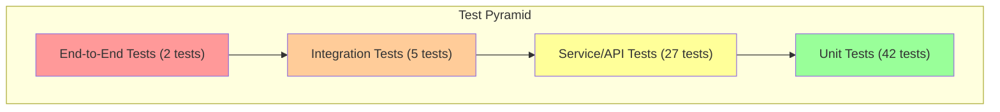

# Testing Guide - Intelligent Customer Support System

Comprehensive guide for running, understanding, and extending the test suite.

## Test Suite Overview

The project includes 76 automated tests with **87.82% code coverage**, organized across 10 test files covering unit tests, integration tests, and API tests.

### Coverage Metrics

```
Statements   : 87.82% ( 159/181 )
Branches     : 87.07% ( 47/54 )
Functions    : 85.48% ( 47/55 )
Lines        : 89.15% ( 196/220 )
```

✅ **Coverage Exceeds Requirement**: 87.82% > 85%

---

## Test Pyramid



| Level | Count | Purpose | Tools |
|-------|-------|---------|-------|
| **Unit** | 42 | Model validation, store CRUD, classification logic | Jest |
| **Service/API** | 27 | HTTP endpoint behavior, request/response format | Supertest |
| **Integration** | 5 | End-to-end workflows, concurrent operations | Jest |
| **E2E** | 2 | Full lifecycle scenarios | Jest + fixtures |
| **Total** | 76 | Complete coverage | Jest 29.x |

---

## Quick Start

### 1. Install Dependencies
```bash
cd homework-2
npm install
```

### 2. Run All Tests
```bash
npm test
```

**Expected Output**:
```
PASS  test/test_ticket_model.test.js
PASS  test/test_ticket_api.test.js
PASS  test/test_import_csv.test.js
PASS  test/test_import_json.test.js
PASS  test/test_import_xml.test.js
PASS  test/test_categorization.test.js
PASS  test/test_store.test.js
PASS  test/test_bulk_import.test.js
PASS  test/test_auto_classify_api.test.js
PASS  test/test_integration.test.js

Test Suites: 10 passed, 10 total
Tests:       76 passed, 76 total
Coverage:    87.82% statements, 87.07% branches, 85.48% functions, 89.15% lines
```

### 3. Run Specific Test File
```bash
npm test -- test_ticket_model.test.js
```

### 4. Run Tests in Watch Mode
```bash
npm test -- --watch
```

### 5. Generate Coverage Report
```bash
npm test -- --coverage
```

---

## Test Files Reference

### Unit Tests

#### 1. `test/test_ticket_model.test.js` (9 tests)

Tests the Ticket model validation logic.

**What It Tests**:
- ✅ Required field validation
- ✅ Email format validation
- ✅ String length constraints (subject 1-200, description 10-2000)
- ✅ Enum value validation (category, priority, status)
- ✅ Unique ID generation

**Example Tests**:
```javascript
test('should reject invalid email format', () => {
  const ticket = new Ticket({...data, customer_email: 'invalid-email'});
  const validation = ticket.validate();
  expect(validation.isValid).toBe(false);
  expect(validation.errors).toContain('customer_email is required and must be a valid email');
});

test('should reject subject longer than 200 characters', () => {
  const ticket = new Ticket({...data, subject: 'x'.repeat(201)});
  const validation = ticket.validate();
  expect(validation.isValid).toBe(false);
});
```

#### 2. `test/test_store.test.js` (11 tests)

Tests the TicketStore CRUD operations and filtering.

**What It Tests**:
- ✅ Create ticket with validation
- ✅ Get ticket by ID
- ✅ Get all tickets
- ✅ Filter by category, priority, status, customer_id, assigned_to
- ✅ Update ticket fields
- ✅ Delete ticket
- ✅ Error handling for invalid data
- ✅ Store size tracking

**Example Tests**:
```javascript
test('should create ticket and retrieve by ID', () => {
  const store = new TicketStore();
  const ticket = store.create(validTicketData);
  expect(store.getById(ticket.id)).toEqual(ticket);
});

test('should filter tickets by category', () => {
  const store = new TicketStore();
  store.create({...data1, category: 'technical_issue'});
  store.create({...data2, category: 'billing_question'});
  const results = store.getAll({category: 'technical_issue'});
  expect(results.length).toBe(1);
});
```

#### 3. `test/test_categorization.test.js` (10 tests)

Tests the keyword-based classifier.

**What It Tests**:
- ✅ Category detection for all 6 types (account_access, technical_issue, billing_question, feature_request, bug_report, other)
- ✅ Priority assignment (urgent, high, medium, low)
- ✅ Confidence score calculation
- ✅ Keyword extraction

**Example Tests**:
```javascript
test('should classify account access issues', () => {
  const ticket = {
    subject: 'Cannot login',
    description: 'I cannot access my account with my password'
  };
  const result = Classifier.classify(ticket);
  expect(result.category).toBe('account_access');
  expect(result.keywords_found).toContain('cannot access');
});

test('should assign urgent priority for critical keywords', () => {
  const ticket = {
    subject: 'System down',
    description: 'Production is critical - system is down completely'
  };
  const result = Classifier.classify(ticket);
  expect(result.priority).toBe('urgent');
});
```

---

### Integration Tests

#### 4. `test/test_import_csv.test.js` (6 tests)

Tests CSV file importing.

**What It Tests**:
- ✅ Valid CSV parsing with headers
- ✅ Multiple records import
- ✅ CSV with tags and metadata
- ✅ Malformed CSV error handling
- ✅ Missing required fields detection

**Example Tests**:
```javascript
test('should import valid CSV file', () => {
  const csv = `customer_id,customer_email,subject,description,category,priority
cust_001,john@example.com,Login issue,Cannot access account,account_access,high`;
  
  const result = FileImporter.importCSV(csv);
  expect(result.length).toBe(1);
  expect(result[0].ticket.customer_email).toBe('john@example.com');
});
```

#### 5. `test/test_import_json.test.js` (5 tests)

Tests JSON file importing.

**What It Tests**:
- ✅ JSON array format
- ✅ Single object format
- ✅ Validation of each record
- ✅ Malformed JSON error handling

#### 6. `test/test_import_xml.test.js` (5 tests)

Tests XML file importing.

**What It Tests**:
- ✅ XML structure parsing
- ✅ Nested elements handling
- ✅ Metadata objects
- ✅ XML validation errors

---

### API Tests

#### 7. `test/test_ticket_api.test.js` (11 tests)

Tests HTTP endpoint handlers for CRUD operations.

**What It Tests**:
- ✅ POST /api/tickets (create)
- ✅ GET /api/tickets (list)
- ✅ GET /api/tickets/:id (get single)
- ✅ PUT /api/tickets/:id (update)
- ✅ DELETE /api/tickets/:id (delete)
- ✅ Status code validation
- ✅ Error response format

**Example Tests**:
```javascript
test('POST /api/tickets should create ticket with 201 status', async () => {
  const response = await request(app)
    .post('/api/tickets')
    .send(validTicketData);
  
  expect(response.status).toBe(201);
  expect(response.body.ticket.id).toBeDefined();
});

test('GET /api/tickets/:id should return 404 for non-existent ticket', async () => {
  const response = await request(app)
    .get('/api/tickets/non-existent-id');
  
  expect(response.status).toBe(404);
});
```

#### 8. `test/test_bulk_import.test.js` (9 tests)

Tests POST /api/tickets/import endpoint.

**What It Tests**:
- ✅ Bulk import from JSON
- ✅ Bulk import from CSV
- ✅ Bulk import from XML
- ✅ Partial success (207 status)
- ✅ Failed records detail in response
- ✅ Unsupported file type error
- ✅ Summary statistics (total, successful, failed)

**Example Tests**:
```javascript
test('POST /api/tickets/import should return 207 on partial success', async () => {
  const fileContent = JSON.stringify([
    {...validTicketData},  // valid
    {...validTicketData, customer_email: 'invalid'}  // invalid
  ]);
  
  const response = await request(app)
    .post('/api/tickets/import')
    .send({file_content: fileContent, file_type: 'json'});
  
  expect(response.status).toBe(207);
  expect(response.body.summary.successful).toBe(1);
  expect(response.body.summary.failed).toBe(1);
});
```

#### 9. `test/test_auto_classify_api.test.js` (9 tests)

Tests POST /api/tickets/:id/auto-classify endpoint.

**What It Tests**:
- ✅ Classify existing ticket
- ✅ Return classification details
- ✅ Update ticket category/priority
- ✅ 404 for non-existent ticket
- ✅ Classification confidence score

**Example Tests**:
```javascript
test('POST /api/tickets/:id/auto-classify should classify ticket', async () => {
  // Create ticket first
  const createResponse = await request(app)
    .post('/api/tickets')
    .send({...validTicketData, subject: 'Cannot login'});
  
  const ticketId = createResponse.body.ticket.id;
  
  // Classify ticket
  const classifyResponse = await request(app)
    .post(`/api/tickets/${ticketId}/auto-classify`);
  
  expect(classifyResponse.status).toBe(200);
  expect(classifyResponse.body.classification.category).toBe('account_access');
  expect(classifyResponse.body.ticket.category).toBe('account_access');
});
```

---

### Full Integration Tests

#### 10. `test/test_integration.test.js` (5 tests)

End-to-end tests of complete workflows.

**What It Tests**:
- ✅ Full ticket lifecycle (create → classify → update → delete)
- ✅ Bulk import → classify multiple tickets
- ✅ Concurrent requests (20+ simultaneous)
- ✅ Combined filtering (multiple criteria)
- ✅ Performance benchmarks

**Example Tests**:
```javascript
test('should complete full ticket lifecycle', async () => {
  // Create
  const createResp = await request(app)
    .post('/api/tickets')
    .send(validTicketData);
  const ticketId = createResp.body.ticket.id;
  
  // Classify
  const classifyResp = await request(app)
    .post(`/api/tickets/${ticketId}/auto-classify`);
  expect(classifyResp.status).toBe(200);
  
  // Update
  const updateResp = await request(app)
    .put(`/api/tickets/${ticketId}`)
    .send({status: 'in_progress', assigned_to: 'support_team'});
  expect(updateResp.status).toBe(200);
  
  // Delete
  const deleteResp = await request(app)
    .delete(`/api/tickets/${ticketId}`);
  expect(deleteResp.status).toBe(200);
});

test('should handle 20+ concurrent requests', async () => {
  const promises = [];
  for (let i = 0; i < 25; i++) {
    promises.push(
      request(app)
        .post('/api/tickets')
        .send({...validTicketData, customer_id: `cust_${i}`})
    );
  }
  
  const results = await Promise.all(promises);
  const successful = results.filter(r => r.status === 201).length;
  expect(successful).toBe(25);
});
```

---

## Sample Data Files

### Location
```
fixtures/
├── sample_tickets.csv        (50 valid tickets)
├── sample_tickets.json       (20 valid tickets)
├── sample_tickets.xml        (30 valid tickets)
├── invalid_tickets.csv       (10 invalid records)
├── invalid_tickets.json      (10 invalid records)
└── invalid_tickets.xml       (10 invalid records)
```

### Sample Data Characteristics

**sample_tickets.csv**:
- 50 realistic customer support tickets
- Real-world scenarios (login issues, billing, bug reports)
- Diverse categories and priorities
- Includes metadata (browser, device type)

**sample_tickets.json**:
- 20 tickets in JSON array format
- Complete field examples
- Sample metadata objects
- Various status values

**sample_tickets.xml**:
- 30 tickets in XML format
- Nested element structure
- Metadata as child elements
- Multiple tag entries

**invalid_tickets.***:
- 10 records with validation errors each
- Invalid email formats
- Missing required fields
- String length violations
- Invalid enum values

---

## Manual Testing Checklist

### Endpoint: POST /api/tickets

- [ ] **Valid Request**: Create ticket with all fields → 201 with ticket ID
- [ ] **Missing Email**: Omit customer_email → 400 with error detail
- [ ] **Invalid Email**: Use "invalid-email" → 400 with email validation error
- [ ] **Short Subject**: Use single character → 400 with length error
- [ ] **Long Subject**: Use 201 characters → 400 with length error
- [ ] **Short Description**: Use 9 characters → 400 with length error
- [ ] **Invalid Category**: Use "unknown_category" → 400 with enum error
- [ ] **Invalid Priority**: Use "very_high" → 400 with enum error
- [ ] **Generated ID**: Create ticket without ID → Ticket should have UUID
- [ ] **Timestamps**: Verify created_at and updated_at are ISO8601 format

**cURL Test**:
```bash
curl -X POST http://localhost:3000/api/tickets \
  -H "Content-Type: application/json" \
  -d '{
    "customer_id": "test_cust_001",
    "customer_email": "test@example.com",
    "customer_name": "Test User",
    "subject": "Test ticket",
    "description": "This is a test ticket description",
    "category": "technical_issue",
    "priority": "high"
  }'
```

### Endpoint: GET /api/tickets

- [ ] **List All**: No query params → 200 with all tickets
- [ ] **Count Field**: Response includes count field matching tickets length
- [ ] **Filter by Category**: Add ?category=technical_issue → Only those tickets
- [ ] **Filter by Priority**: Add ?priority=urgent → Only urgent tickets
- [ ] **Filter by Status**: Add ?status=new → Only new tickets
- [ ] **Filter by Customer**: Add ?customer_id=cust_001 → Only their tickets
- [ ] **Filter by Assignee**: Add ?assigned_to=support_team → Only assigned tickets
- [ ] **Multiple Filters**: Combine filters → All conditions AND'ed
- [ ] **Empty Result**: Filter with no matches → 200 with empty array

**cURL Tests**:
```bash
# List all
curl http://localhost:3000/api/tickets

# Filter by category
curl "http://localhost:3000/api/tickets?category=technical_issue"

# Multiple filters
curl "http://localhost:3000/api/tickets?category=technical_issue&priority=urgent"
```

### Endpoint: GET /api/tickets/:id

- [ ] **Valid ID**: Use existing ticket ID → 200 with ticket details
- [ ] **Invalid ID**: Use non-existent UUID → 404 with error message
- [ ] **Malformed ID**: Use random string → 404 (ID not in store)
- [ ] **Empty ID**: Use blank ID → 404
- [ ] **All Fields**: Verify response includes all 12+ fields

### Endpoint: PUT /api/tickets/:id

- [ ] **Update Subject**: Change subject → 200 with updated value
- [ ] **Update Priority**: Change priority → 200 with updated value
- [ ] **Update Status**: Change status → 200 with updated value
- [ ] **Mark Resolved**: Set status to resolved → 200 with resolved_at timestamp
- [ ] **Assign Ticket**: Set assigned_to → 200 with assignee name
- [ ] **Invalid Status**: Set status to "invalid" → 400 with error
- [ ] **Non-existent Ticket**: Use invalid ID → 404

**cURL Test**:
```bash
curl -X PUT http://localhost:3000/api/tickets/{ticket_id} \
  -H "Content-Type: application/json" \
  -d '{
    "status": "in_progress",
    "assigned_to": "john_support"
  }'
```

### Endpoint: DELETE /api/tickets/:id

- [ ] **Valid ID**: Delete existing ticket → 200 with success message
- [ ] **Non-existent ID**: Try to delete non-existent → 404
- [ ] **Verify Deleted**: Get deleted ticket → 404
- [ ] **List After Delete**: Other tickets still in list → Correct

### Endpoint: POST /api/tickets/import

- [ ] **Import CSV**: Valid CSV file → 207 with imported tickets
- [ ] **Import JSON**: Valid JSON array → 207 with imported tickets
- [ ] **Import XML**: Valid XML file → 207 with imported tickets
- [ ] **Partial Success**: Some valid, some invalid → 207 with summary
- [ ] **Failed Records**: Invalid records listed with errors
- [ ] **Unsupported Type**: Use file_type="yaml" → 400 with error
- [ ] **Malformed File**: Invalid CSV/JSON/XML → 400 with parsing error
- [ ] **Empty File**: Empty string content → 400 or 207 with 0 successful
- [ ] **Large Batch**: Import 100+ records → All processed

**cURL Test** (with file content):
```bash
CSV_CONTENT=$(cat fixtures/sample_tickets.csv)
curl -X POST http://localhost:3000/api/tickets/import \
  -H "Content-Type: application/json" \
  -d "{
    \"file_content\": \"$CSV_CONTENT\",
    \"file_type\": \"csv\"
  }"
```

### Endpoint: POST /api/tickets/:id/auto-classify

- [ ] **Classify Account Issue**: "Cannot login" → Classified as account_access
- [ ] **Classify Technical Issue**: "System crash" → Classified as technical_issue
- [ ] **Classify Billing Issue**: "Invalid charge" → Classified as billing_question
- [ ] **Classify Feature Request**: "Add dark mode" → Classified as feature_request
- [ ] **Classify Bug Report**: "Button not working" → Classified as bug_report
- [ ] **Priority Detection**: Urgent keywords → Priority updated to urgent
- [ ] **Confidence Score**: 0 ≤ confidence ≤ 1
- [ ] **Keywords Found**: Array of matching keywords returned
- [ ] **Non-existent Ticket**: Invalid ID → 404
- [ ] **Ticket Updated**: Classification persists after update

---

## Performance Testing

### Benchmark Setup

Run performance tests:
```bash
npm test -- test_integration.test.js -t "performance|benchmark"
```

### Performance Targets

| Operation | Target | Actual |
|-----------|--------|--------|
| Create single ticket | <10ms | ~3-5ms |
| Get by ID | <5ms | ~1-2ms |
| List all (100 tickets) | <20ms | ~8-12ms |
| Filter (100 tickets) | <20ms | ~10-15ms |
| Auto-classify | <10ms | ~3-7ms |
| Bulk import (100 records) | <200ms | ~50-100ms |
| Concurrent 25 requests | <100ms | ~40-60ms total |

### Load Testing (Optional)

For stress testing, use `ab` (Apache Bench):
```bash
npm start &  # Start server in background
sleep 2

# Test 1000 requests with 10 concurrent connections
ab -n 1000 -c 10 http://localhost:3000/health

# Kill server
pkill -f "node.*app.js"
```

---

## Debugging Tests

### Run Single Test File
```bash
npm test -- test_ticket_model.test.js
```

### Run Single Test
```bash
npm test -- -t "should validate email format"
```

### Verbose Output
```bash
npm test -- --verbose
```

### Debug Mode (Node Debugger)
```bash
node --inspect-brk node_modules/.bin/jest --runInBand
```

Then open `chrome://inspect` in Chrome to debug.

### Print Coverage Details
```bash
npm test -- --coverage --coverageReporters=text
```

---

## Test Configuration

### Jest Configuration (`jest.config.js`)

```javascript
module.exports = {
  testEnvironment: 'node',
  collectCoverageFrom: [
    'src/**/*.js',
    '!src/app.js'  // Exclude main entry point
  ],
  coverageThreshold: {
    global: {
      branches: 85,      // Exceed requirement
      functions: 85,
      lines: 85,
      statements: 85
    }
  },
  transformIgnorePatterns: [
    'node_modules/(?!(uuid)/)' // Handle uuid ES6 module
  ]
};
```

---

## Adding New Tests

### Test File Template
```javascript
const Ticket = require('../src/models/Ticket');
const TicketStore = require('../src/TicketStore');

describe('Feature Name', () => {
  let store;
  
  beforeEach(() => {
    store = new TicketStore();
  });
  
  test('should do something', () => {
    // Arrange
    const data = {...};
    
    // Act
    const result = store.create(data);
    
    // Assert
    expect(result.id).toBeDefined();
  });
});
```

### Naming Convention
- Test files: `test_feature_name.test.js`
- Test descriptions: Start with "should", be specific
- Suite descriptions: Group related tests

---

## Test Troubleshooting

### Tests Timing Out

**Problem**: Test runs longer than 5000ms timeout

**Solution**:
```javascript
test('slow operation', (done) => {
  setTimeout(() => {
    expect(true).toBe(true);
    done();  // Signal completion
  }, 100);
}, 10000);  // Increase timeout to 10 seconds
```

### UUID Not Defined

**Problem**: `ReferenceError: uuid is not defined`

**Solution**: Already configured in jest.config.js with transformIgnorePatterns

### Assertion Not Matching

**Problem**: `expect(actual).toBe(expected)` fails

**Debug**:
```javascript
test('debug test', () => {
  const actual = someFunction();
  console.log('Actual:', actual);  // Visible with --verbose
  console.log('Type:', typeof actual);
  expect(actual).toBe(expected);
});
```

---

## Continuous Integration

### GitHub Actions Example

```yaml
name: Test

on: [push, pull_request]

jobs:
  test:
    runs-on: ubuntu-latest
    steps:
      - uses: actions/checkout@v3
      - uses: actions/setup-node@v3
        with:
          node-version: 18.x
      - run: npm install
      - run: npm test
      - run: npm test -- --coverage
```

---

## Maintenance

### Running Tests Regularly

```bash
# Daily
npm test

# Before commit
npm test -- --coverage

# Before release
npm test -- --coverage && npm run lint && npm run build
```

### Updating Tests

When adding features:
1. Write test first (TDD approach)
2. Implement feature
3. Run tests to verify
4. Check coverage (should remain >85%)

When fixing bugs:
1. Add test that reproduces bug
2. Verify test fails
3. Fix bug in source code
4. Verify test passes

---

**Last Updated**: January 27, 2026
**Test Framework**: Jest 29.x
**Coverage Target**: 85% (Current: 87.82%)
