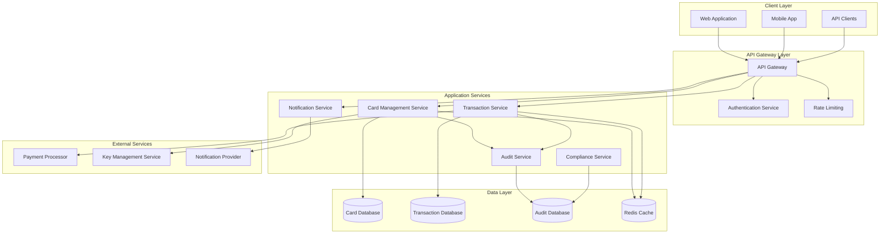
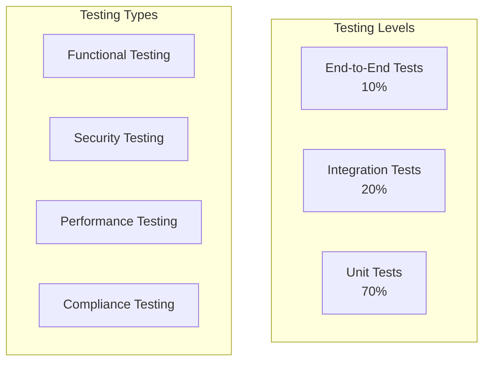

# Virtual Card Management System Design Document

## Overview

The Virtual Card Management System is a secure, compliant financial application that provides comprehensive virtual payment card lifecycle management. The system follows microservices architecture with strong emphasis on security, auditability, and regulatory compliance suitable for FinTech environments.

## Architecture

### System Architecture



### Technology Stack

- **Backend Framework**: Node.js with Express.js for REST APIs
- **Database**: PostgreSQL for transactional data, MongoDB for audit logs
- **Caching**: Redis for session management and performance optimization
- **Authentication**: JWT tokens with OAuth 2.0 integration
- **Message Queue**: RabbitMQ for asynchronous processing
- **Monitoring**: Prometheus and Grafana for system metrics
- **Security**: HashiCorp Vault for secrets management

## Components and Interfaces

### Card Management Service

**Responsibilities:**
- Virtual card creation and lifecycle management
- Card status management (active, frozen, suspended)
- Spending limit configuration and enforcement
- Card metadata and security controls

**Key Interfaces:**
```typescript
interface CardManagementService {
  createVirtualCard(userId: string, cardRequest: CreateCardRequest): Promise<VirtualCard>
  updateCardStatus(cardId: string, status: CardStatus): Promise<void>
  setSpendingLimit(cardId: string, limit: SpendingLimit): Promise<void>
  getCardDetails(cardId: string): Promise<VirtualCard>
  listUserCards(userId: string): Promise<VirtualCard[]>
}

interface VirtualCard {
  cardId: string
  userId: string
  cardNumber: string // PCI-compliant encrypted storage
  expiryDate: string
  cvv: string // Encrypted
  status: CardStatus
  spendingLimit: SpendingLimit
  createdAt: Date
  updatedAt: Date
}
```

### Transaction Service

**Responsibilities:**
- Transaction processing and validation
- Real-time spending limit enforcement
- Transaction history and filtering
- Fraud detection integration

**Key Interfaces:**
```typescript
interface TransactionService {
  processTransaction(transactionRequest: TransactionRequest): Promise<TransactionResult>
  getTransactionHistory(cardId: string, filters: TransactionFilters): Promise<Transaction[]>
  flagSuspiciousTransaction(transactionId: string): Promise<void>
}

interface Transaction {
  transactionId: string
  cardId: string
  amount: Decimal
  currency: string
  merchantName: string
  merchantCategory: string
  timestamp: Date
  status: TransactionStatus
  location?: GeoLocation
}
```

### Audit Service

**Responsibilities:**
- Immutable audit trail maintenance
- Compliance reporting and data retention
- Regulatory requirement adherence
- Audit log search and filtering

**Key Interfaces:**
```typescript
interface AuditService {
  logEvent(event: AuditEvent): Promise<void>
  searchAuditLogs(criteria: AuditSearchCriteria): Promise<AuditEvent[]>
  generateComplianceReport(reportType: ReportType, dateRange: DateRange): Promise<ComplianceReport>
}

interface AuditEvent {
  eventId: string
  userId: string
  eventType: string
  entityId: string
  entityType: string
  action: string
  timestamp: Date
  ipAddress: string
  userAgent: string
  result: 'SUCCESS' | 'FAILURE'
  details: Record<string, any>
}
```

### Notification Service

**Responsibilities:**
- Real-time transaction notifications
- Security alert management
- Multi-channel notification delivery
- Notification preference management

## Data Models

### Core Entities

```sql
-- Virtual Cards Table
CREATE TABLE virtual_cards (
    card_id UUID PRIMARY KEY,
    user_id UUID NOT NULL,
    card_number_encrypted TEXT NOT NULL,
    expiry_date DATE NOT NULL,
    cvv_encrypted TEXT NOT NULL,
    status VARCHAR(20) NOT NULL DEFAULT 'ACTIVE',
    daily_limit DECIMAL(15,2),
    monthly_limit DECIMAL(15,2),
    created_at TIMESTAMP DEFAULT CURRENT_TIMESTAMP,
    updated_at TIMESTAMP DEFAULT CURRENT_TIMESTAMP,
    CONSTRAINT fk_user FOREIGN KEY (user_id) REFERENCES users(user_id)
);

-- Transactions Table
CREATE TABLE transactions (
    transaction_id UUID PRIMARY KEY,
    card_id UUID NOT NULL,
    amount DECIMAL(15,2) NOT NULL,
    currency CHAR(3) NOT NULL DEFAULT 'USD',
    merchant_name VARCHAR(255) NOT NULL,
    merchant_category VARCHAR(100),
    transaction_date TIMESTAMP NOT NULL,
    status VARCHAR(20) NOT NULL,
    location_data JSONB,
    created_at TIMESTAMP DEFAULT CURRENT_TIMESTAMP,
    CONSTRAINT fk_card FOREIGN KEY (card_id) REFERENCES virtual_cards(card_id)
);

-- Audit Events Table (MongoDB Document)
{
  "_id": ObjectId,
  "eventId": "uuid",
  "userId": "uuid",
  "eventType": "CARD_CREATED | CARD_STATUS_CHANGED | TRANSACTION_PROCESSED",
  "entityId": "uuid",
  "entityType": "VIRTUAL_CARD | TRANSACTION",
  "action": "CREATE | UPDATE | DELETE | PROCESS",
  "timestamp": ISODate,
  "ipAddress": "string",
  "userAgent": "string",
  "result": "SUCCESS | FAILURE",
  "details": {
    "previousValues": {},
    "newValues": {},
    "errorMessage": "string"
  }
}
```

### Data Security and Encryption

- **PCI DSS Compliance**: All card data encrypted using AES-256
- **Field-Level Encryption**: Card numbers, CVV, and PII encrypted at rest
- **Key Rotation**: Automated encryption key rotation every 90 days
- **Data Masking**: Sensitive data masked in logs and non-production environments

## Error Handling

### Error Classification

```typescript
enum ErrorType {
  VALIDATION_ERROR = 'VALIDATION_ERROR',
  AUTHENTICATION_ERROR = 'AUTHENTICATION_ERROR',
  AUTHORIZATION_ERROR = 'AUTHORIZATION_ERROR',
  BUSINESS_RULE_ERROR = 'BUSINESS_RULE_ERROR',
  EXTERNAL_SERVICE_ERROR = 'EXTERNAL_SERVICE_ERROR',
  SYSTEM_ERROR = 'SYSTEM_ERROR'
}

interface ApiError {
  code: string
  message: string
  type: ErrorType
  details?: Record<string, any>
  timestamp: Date
  requestId: string
}
```

### Error Response Standards

- **4xx Client Errors**: Input validation, authentication, authorization failures
- **5xx Server Errors**: System failures, external service unavailability
- **Structured Error Responses**: Consistent error format across all endpoints
- **Error Correlation**: Unique request IDs for error tracking and debugging

### Resilience Patterns

- **Circuit Breaker**: Prevent cascade failures from external services
- **Retry Logic**: Exponential backoff for transient failures
- **Timeout Management**: Appropriate timeouts for all external calls
- **Graceful Degradation**: Fallback mechanisms for non-critical features

## Testing Strategy

### Testing Pyramid



### Test Categories

**Unit Tests (70%)**
- Service layer business logic
- Data validation and transformation
- Utility functions and helpers
- Error handling scenarios

**Integration Tests (20%)**
- Database operations and transactions
- External service integrations
- API endpoint functionality
- Message queue processing

**End-to-End Tests (10%)**
- Complete user workflows
- Cross-service communication
- Security and compliance scenarios
- Performance under load

### Security Testing

- **Penetration Testing**: Regular security assessments
- **Vulnerability Scanning**: Automated security scans
- **Compliance Testing**: PCI DSS and regulatory requirement validation
- **Data Privacy Testing**: GDPR and data protection compliance

### Performance Testing

- **Load Testing**: Normal traffic simulation
- **Stress Testing**: Peak load and breaking point analysis
- **Volume Testing**: Large dataset handling
- **Endurance Testing**: Long-running system stability

### Compliance Testing

- **Audit Trail Validation**: Ensure all operations are logged
- **Data Retention Testing**: Verify 7-year retention compliance
- **Access Control Testing**: Role-based permission validation
- **Regulatory Reporting**: Compliance report accuracy verification